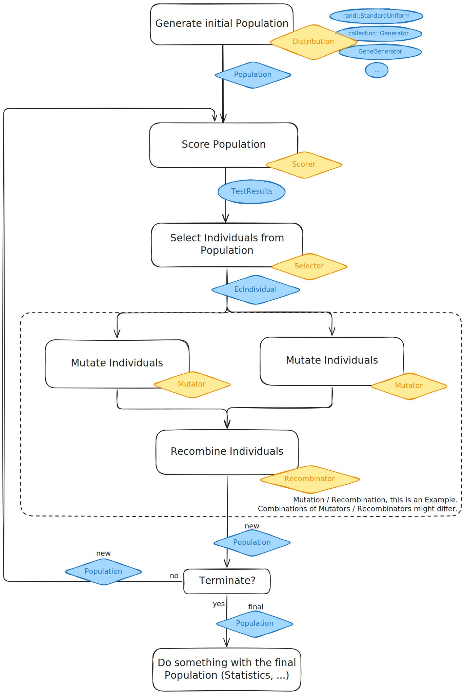

# ec-core

This crate is a part of the [unhindered-ec](https://unhindered.ec) project.

## Structure

The diagram below illustrates an example of a common evolutionary
process.

We start by generating a random initial `Population` of
of `Individual`s. These `Individual`s are then `Score`d, and those
`Score`s are used to select the "best" individuals to be used as
parents. Those parent individuals are modified using mutation and
recombination operators to form a new population made up of child individuals.
This process repeats until some exit condition is reached, e.g., we have
found an optimal score or the maximum number of generations is reached, etc.

See [`ec-linear/examples`](../ec-linear/examples/) for implementations of
simple bit-string evolutionary processes. See [`push/examples`](../push/examples/)
for implementations of evolutionary processes using PushGP to evolve Push
programs.

## Tools

This crate provides core evolutionary computation functionality, such as interfaces for

- `Genome`
- `Individual`
- `Population`
- `Generation`

This also includes support for `Operator`s, which encapsulate logic that maps from one
type to another. This includes

- `Scorer`, which maps from an `Individual` to a `Score`. The `Score`s are used to
- `Selector`, which maps from a `Population` of `Individual`s to a single, selected individual. This
  is typically how parents are selected, preferring individuals with better scores.
- `Mutator`, which maps from one `Genome` to a (presumably modified) `Genome` via some kind of mutation operator
- `Recombinator`, which maps from one or more `Genome`s to a (child) `Genome` via some kind of recombination operator like uniform crossover
- Tools for composing operators such as `And` and `Then`.
