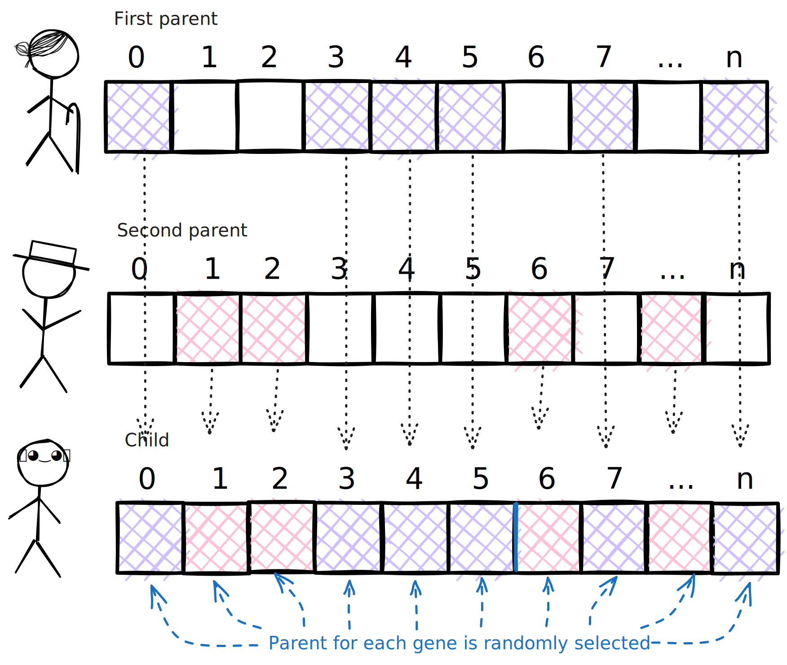
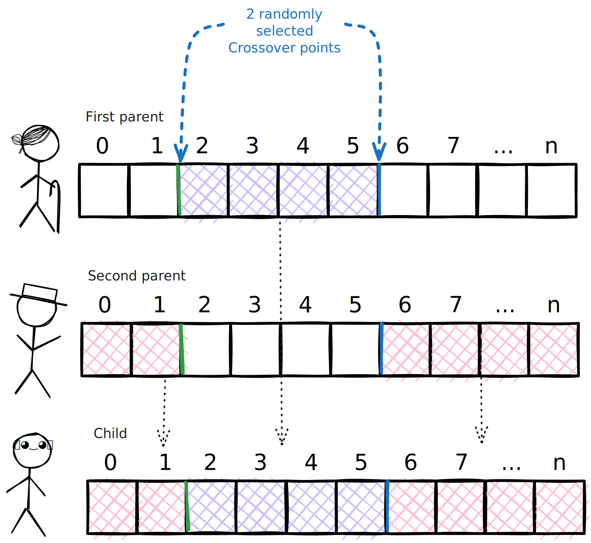

# ec-linear

This crate is a part of the [unhindered-ec](https://unhindered.ec) project.

This crate provides implementations for basic tools for evolving
linear structures such as bitstrings and Plushy genomes (see `push`
crate). There is support for both fixed-length and variable-length
linear genomes.

## Mutation operators

This crate includes a few mutation operators such as:

- `Umad` (uniform mutation through addition and deletion), which adds and deletes elements.
- `WithRate` which mutates elements with a given mutation rate.
- `WithOneOverLength` which mutates elements with the mutation rate $1/L$ where, $L$ is the length of the genome.

The `Umad` mutation operator can change the length of the genome and so can only be used with variable-length linear genomes. The other two
mutation operators maintain the length of the genome and can be used
with both fixed-length and variable-length genomes.

## Recombination operators

This crate includes a few recombination operators based on the
`Crossover` trait.

### `UniformXo`: Uniform crossover

`UniformXo` implements uniform crossover, choosing genes uniformly from two parents as illustrated below:



### `TwoPointXo`: Two-point crossover

`TwoPointXo` implements two-point crossover, choosing two random locations along the parent genomes, and swapping sections as illustrated below.


 <figure>

 

  <figcaption>

  *Illustration of two-point crossover. Alternatively see
  [this animation](../../images/TwoPointCrossover.avif).*

  </figcaption>
</figure>

---

## Examples

The [examples directory](examples/) has two examples of performing
evolution on bitstrings:

- [`count_ones`](examples/count_ones/main.rs), an implementation of
  [the classic OneMax problem](https://schlosserpg.github.io/Heuristic/benchmark.html#onemax-problem),
  where the goal is to maximize the number of 1s in a bitstring
- [`hiff`](examples/hiff/main.rs), based on [Watson's Hierarchical If-and-only-if problem](https://doi.org/10.1109/CEC.1999.782647)

To run an example:

```bash
cargo run --release --example <name> -- <parameter settings>
```

where `<name>` is replaced by the name of the example (e.g., `hiff`).
Problems provide a set of optional parameter settings that allow you to
set things like the population size and the maximum number of generations.

To see the available parameters for a given example:

```bash
cargo run --release --example <name> -- --help
```
